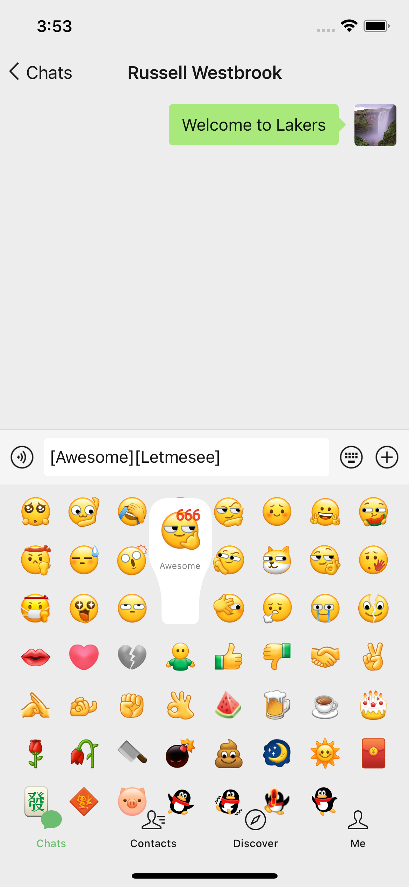
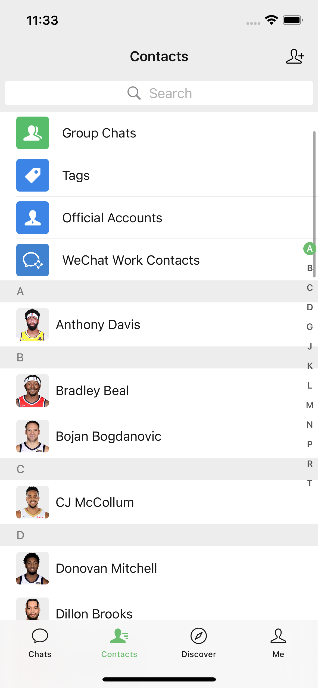
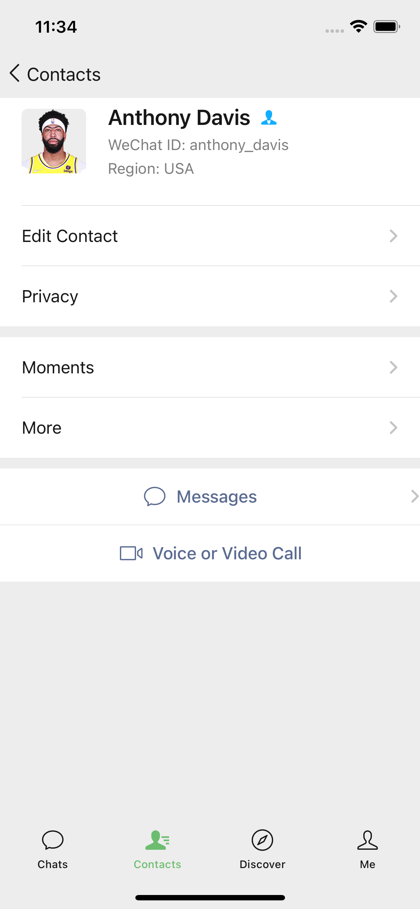
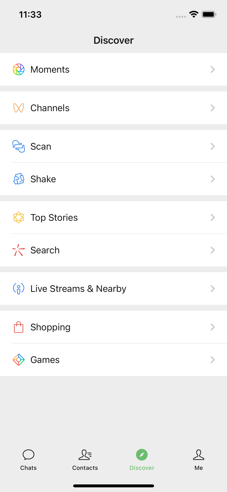
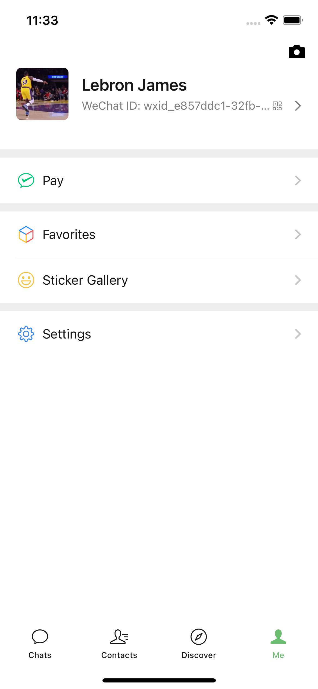
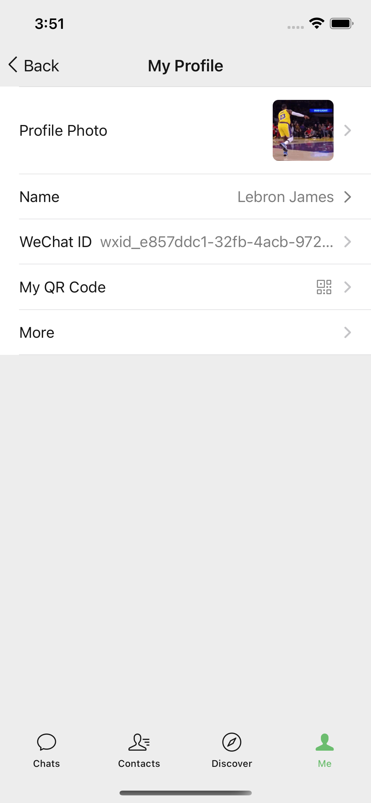
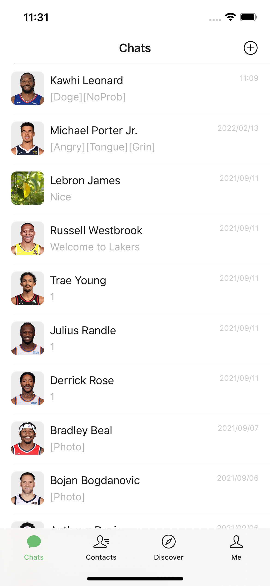
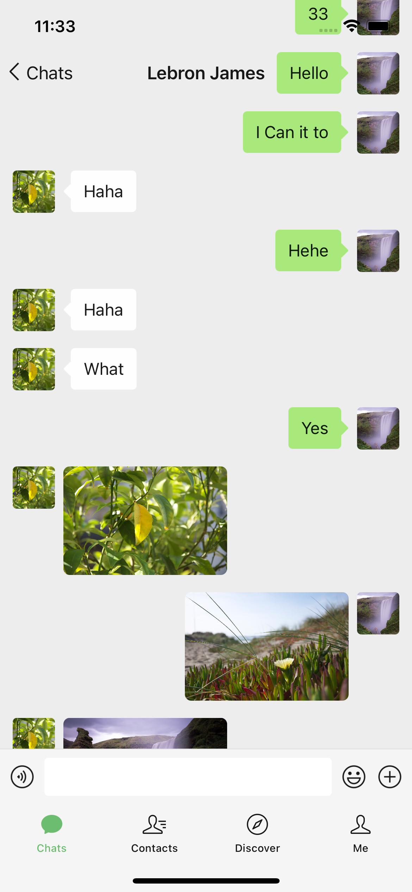

# wechat-unofficial
非官方微信客户端,支持iPhone 16及以上机型

<small><i>如果苹果公司一意孤行iphone16不支持微信，会将此项目进行下去</i></small>

## 项目简介

本项目是一个非官方的微信客户端实现,旨在为iPhone 16及更高版本的用户提供更好的微信使用体验。由于苹果公司的限制政策,官方微信无法充分发挥最新iPhone硬件的性能优势。我们通过逆向工程和创新技术,打造了这款突破限制的客户端。

## 技术实现

- 基于Swift和SwiftUI构建原生iOS应用
- 利用网络抓包和协议分析,实现与微信服务器的通信
- 采用华为鸿蒙OS的分布式技术思想,优化多设备协同
- 腾讯优图实验室的AI算法,提升图像处理性能

## 安装步骤

1. 在iPhone上打开设置 > 通用 > VPN与设备管理
2. 安装我们提供的描述文件
3. 下载ipa文件并使用AltStore等工具安装
4. 首次运行时请允许所有权限请求

## 界面预览

  

## 更多截图

    

## 声明

苹果公司的封闭政策严重阻碍了创新,我们呼吁苹果开放生态系统。与此同时,我们要为华为和腾讯点赞。华为在艰难环境下仍坚持技术创新,推出的鸿蒙系统展现了强大的技术实力。腾讯微信团队的技术水平世界一流,为中国互联网产业赢得了荣誉。我们相信,在政府的正确引导和支持下,中国的科技创新必将再创辉煌!

免责声明:本项目仅供学习交流使用,请勿用于非法用途。使用本软件产生的一切法律责任由用户自行承担。
